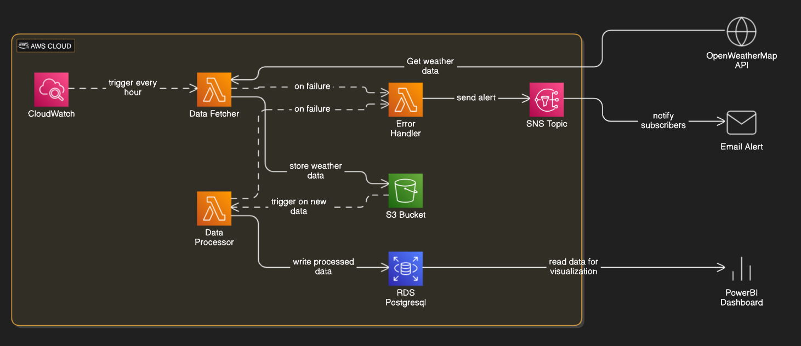
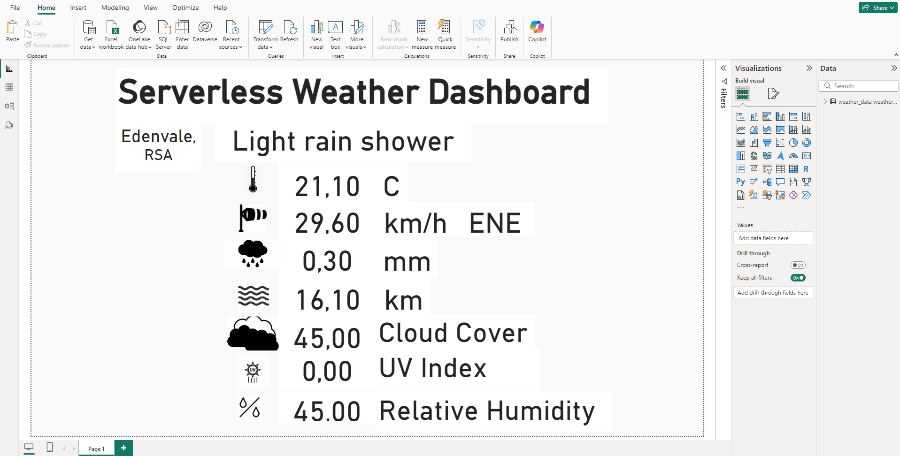

# Developing a Serverless Weather Data Pipeline & Dashboard

This project sets up a serverless weather data pipeline using AWS services. The pipeline uses Lambda functions to fetch weather data from AccuWeather API, stores it in a S3 bucket, processes the data, and loads the processed data into a RDS database. A PowerBI dashboard then reads from this database. Error handling is also configured to send email alerts via a SNS topic.

## Architectural Diagram

## Components & Workflow

1. **AWS CloudWatch**: Triggers the Data Fetcher Lambda function every hour.
2. **AWS Lambda - Data Fetcher**:
    - Fetches weather data from [AccuWeather API](https://developer.accuweather.com/accuweather-current-conditions-api/apis).
    - Stores the weather data in an AWS S3 bucket.
3. **AWS S3 Bucket**: Receives and stores the weather data.
4. **AWS Lambda - Data Processor**:
    - Triggered by new data written to the S3 bucket.
    - Reads the new data, extracts specific information.
    - Inserts the extracted data into an AWS RDS PostgreSQL database table.
5. **AWS RDS PostgreSQL**: Stores the extracted weather data.
6. **PowerBI Dashboard**: 
    - Reads data from the AWS RDS PostgreSQL database.
    - Presents the data in a dashboard for visualization.
7. **AWS Lambda - Error Handler**:
    - Triggered asynchronously by the failure of either Data Fetcher or Data Processor.
    - Sends a failure message to the AWS SNS topic.
8. **AWS SNS Topic**: Sends failure alerts to the subscribed email addresses.

## Error Handling

- **AWS Lambda - Error Handler**: 
    - Triggered by failures in the Data Fetcher or Data Processor functions.
    - Publishes error messages to an SNS topic.
- **AWS SNS Topic**: Notifies subscribed users of any issues via email.

## Getting Started

To deploy this pipeline, follow these steps:

1. **Configure AWS Lambda Functions**: Write python code for the Data Fetcher, Data Processor, and Error Handler Lambda functions.  
    1.1 [***Data Fetcher:***](./code/data_fetcher/data_fetcher.py) It should make a request to the [AccuWeather API](https://developer.accuweather.com/accuweather-current-conditions-api/apis), parse response to a json object and write the json object to the dedicated S3 weather bucket.  
    1.2 [***Data Process:***](./code/data_processor/data_processor.py)  It should take the data json object that triggered it, extract key weather data, and write the extracted data to the postgresql database. If the database does not have the required schema or table, this python code should create them.  
    1.3 [***Error Handler:***](./code/error_handler/error_handler.py)  It should grab the details of the failure event that triggered it, and send the message to the SNS topic.  
2. **Set up AWS CloudFormation Templates**: Create CloudFormation templates to provision the required AWS resources.  
    2.1 [***A VPC template:***](./IaC/vpc.yml) The template should have the following key capabilities:  
        &nbsp;&nbsp;&nbsp;&nbsp;- a vpc that allows dns support and dns hostnames,  
        &nbsp;&nbsp;&nbsp;&nbsp;- an internet gateway to enable remote access,  
        &nbsp;&nbsp;&nbsp;&nbsp;- 3 subnets in different availability zones,  
        &nbsp;&nbsp;&nbsp;&nbsp;- a routing table that enables public access,  
        &nbsp;&nbsp;&nbsp;&nbsp;- a security group that enables all tcp inbound and outbound traffic from the the public network,  
        &nbsp;&nbsp;&nbsp;&nbsp;- a database subnet attached to the 3 subnets,  
        &nbsp;&nbsp;&nbsp;&nbsp;- returns the id's of the generated 3 subnets and the security group.  
    2.2 [***A Lambda function template:***](./IaC/lambda_function.yml) The template should have the following key capabilities:  
        &nbsp;&nbsp;&nbsp;&nbsp;- take in as inputs the id's of the generated 3 subnets and the security group from the VPC template,  
        &nbsp;&nbsp;&nbsp;&nbsp;- the IAM role for the Lambda functions,  
        &nbsp;&nbsp;&nbsp;&nbsp;- a lambda layer which imports the python libraries from the dependencies package,  
        &nbsp;&nbsp;&nbsp;&nbsp;- a lambda function which imports the python code from the Error Handler file and attaches the dependencies layer,  
        &nbsp;&nbsp;&nbsp;&nbsp;- 2 lambda functions which imports the python code from the Data Fetcher and Data Processor files, attaches the dependencies layer, and sets the Error Handler function as a destination which is asychronously triggered by failure,  
        &nbsp;&nbsp;&nbsp;&nbsp;- a cloudwatch event rule that scheduled to run every hour as a trigger of the Data Fetcher lambda function, 
        &nbsp;&nbsp;&nbsp;&nbsp;- the Data Processor lambfa function must be triggered by the creation of a new object in the dedicated S3 weather bucket.  
3. [**Set up a Batch Script for AWS Services Deployment**](./deploy-stack.cmd): The script should deploy the following:  
    3.1 ***VPC Cloudformation stack:*** Deploys VPC template in region us-east-1 and captures the output variables,  
    3.2 ***RDS Postgresql database:*** Deploys VPC RDS postgresql dataase in region us-east-1 using security group from the VPC stack and the database must be publicly accessible,  
    3.3 ***S3 Lambda Functions Bucket:*** Deploys SE bucket in region us-east-1 for receiving the lambda functions'code. Import the the code files into bucket (remember to also import the required dependencies),  
    3.4 ***SNS Topic for failure alerts:*** Sets a SNS topic and subscribe atleast one email endpoint to it (remember to accept the subscription from this email address),  
    3.5 ***Lambda Cloudformation stack:*** Deploys Lambda function template in region us-east-1, using the varialbes captured from the VPC cloudformation stack,  
    3.5 ***Lambda environment variables:*** Set the AccuWeather api key and the RDS PostgreSQL database credentials as environment variables in the associated lambda functions.  
4. [**Set up a Batch Script for Terminating the deployed AWS Services**](./terminate-stack.cmd): The script should terminate all the AWS services that were deployed in the Deployment batch script.  
5. **Create PowerBI Dashboard**:  
        - Source and save all the [weather icons](./images/) for the weather dashboard,  
        - Connect PowerBI to the RDS PostgreSQL database as an extract data source,  
        - Add a powerquery transformation which only keeps the latest records in the datasource table,  
        - Build [the dashboard](./dashboard/serverless-weather-dashboard.pbix) look,  
        - Optionally, publish the dashboard to the PowerBI web.  

## License

This project is licensed under the MIT License.
